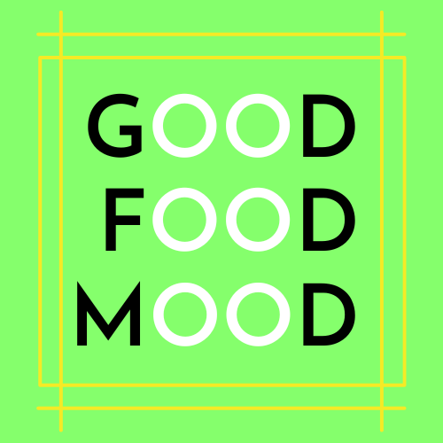

# Good Food Mood

You have been tasked with creating a website called Good Food Mood which helps people to find
recipes. The site is aimed at working people who are interested in eating healthy and interesting
food, but don't have a lot of time to read recipe books. The site should feel fun and engaging for
users and guide them to take action.
Using an API, allow users to input ingredients (and perhaps any dietary concerns) and get back a list
of recipes. The site should also encourage them to sign up for a weekly newsletter with featured
recipes.

Brief
• Create a website for Good Food Mood that appeals to working professionals who are
interested in healthy, tasty, and interesting food.
• Use APIs to create interactive pages. You can find various free and open food-related APIs.
Find one that suits you best.
• The site should include a minimum of 4 pages, be responsive, and function well on a variety
of platforms.
• The site should employ JavaScript/JSON API for dynamic data and construction and styling of
HTML/CSS.
• A contact form with JavaScript validation is required.
• The site should be well-designed and easy to use and conform to WCAG standards.

For a detailed record of my work on this project, you can read that in the report file (.pdf) which is provided in the main folder.

## Built With

HTML
CSS
JAVASCRIPT
Spoonacular API (https://spoonacular.com/food-api)

## Contact

This is where you can leave your social links for people to contact you, such as a LinkedIn profile or Twitter link e.g.

[My email adress](audunroald£gmail.com)
